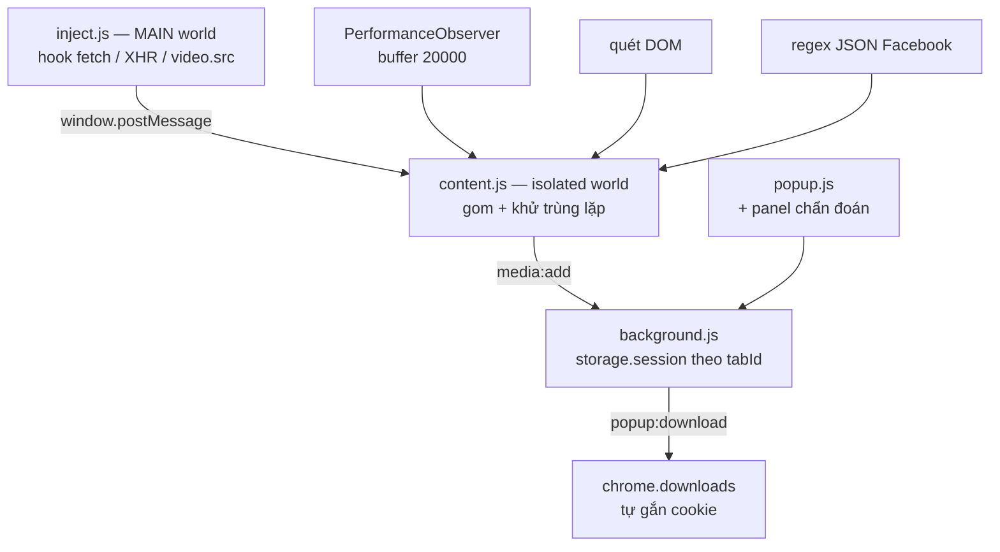

# Video Grabber

Extension Chrome/Edge/Cốc Cốc bắt mọi link video từ trang web đang mở — bao gồm video
trong **group private trên Facebook**.

Không cần cài Python, `yt-dlp` hay `ffmpeg`. Extension dùng chính session đăng nhập
sẵn có của bạn, nên nội dung trong group kín truy cập được mà không cần xác thực thêm.

## Cài đặt

1. Mở `chrome://extensions` (Edge: `edge://extensions`, Cốc Cốc: `coccoc://extensions`)
2. Bật **Developer mode** (góc trên phải)
3. Bấm **Load unpacked** → chọn thư mục `f:\project\fb-video-grabber`
4. Ghim extension lên thanh công cụ

## Cách dùng

### Trang web thông thường

1. Mở trang có video
2. **Bấm play** — extension chỉ thấy luồng dữ liệu khi video thực sự phát
3. Bấm icon extension → danh sách link hiện ra → **Tải**

### Facebook group private

1. Mở bài viết trong group
2. Bấm vào video để nó phát
3. Mở popup → bấm **Quét sâu**
4. Chọn link có nhãn `browser_native_hd_url` (chất lượng cao nhất) → **Tải**

> Link fbcdn có chữ ký và **hết hạn sau khoảng 1–2 giờ**. Nếu tải bị lỗi 403,
> bấm **Quét sâu** lại để lấy URL mới.

### YouTube

1. Mở video YouTube bất kỳ
2. Đợi 1–2 giây để extension quét `ytInitialPlayerResponse`
3. Mở popup → danh sách link hiện ra:
   - **file** (xanh) = progressive stream, có cả video+audio, tải trực tiếp
   - **yt-adapt** (tím) = adaptive stream, chỉ hình hoặc chỉ tiếng
4. **Luôn ưu tiên link `file`** (thường có 360p và 720p)
5. Tải adaptive cần ghép bằng `ffmpeg` ngoài extension

> Tốc độ tải YouTube có thể bị throttle (~50 KB/s). Đây là hạn chế phía server
> của YouTube (n-parameter throttling), không phải lỗi extension.

## Kiến trúc



### Bốn nguồn phát hiện video

| Nguồn | Bắt được gì |
|---|---|
| `inject.js` (MAIN world) | Hook `fetch`, `XMLHttpRequest.open`, `video.src` — bắt được luồng MSE/DASH mà 3 nguồn kia mù |
| `inject.js` YouTube parser | Trích xuất `ytInitialPlayerResponse` + hook fetch `/youtubei/v1/player` (SPA) |
| `PerformanceObserver` | Resource Timing, buffer đã nâng lên 20000 entry |
| Quét DOM | `<video src>`, `<video><source>`, `<a href="*.mp4">` |
| Regex JSON Facebook | `browser_native_hd_url`, `playable_url`, `hd_src`… nhúng trong `<script>` |

Nguồn cuối là lý do group private hoạt động: dữ liệu đó chỉ đọc được vì content
script chạy trong session đã đăng nhập của bạn.

### Hai cái bẫy đã xử lý

**1. Resource Timing buffer tràn.** Chrome mặc định chỉ giữ **250 entry**. Khi đầy,
entry mới bị **vứt bỏ hoàn toàn** và `PerformanceObserver` không hề hay biết.
Facebook nạp quá 250 tài nguyên trong vài giây → video phát sau đó mất trắng.
Đã nâng lên 20000 kèm handler `resourcetimingbufferfull`.

**2. `initiatorType` không phải `'video'`.** Facebook phát video qua MSE, player
gọi `fetch()` bằng JS của chính nó → `initiatorType` là `'fetch'`. Chỉ hook
`fetch`/XHR ở MAIN world mới bắt được.

### Vì sao cần `rules/referer.json`

`fbcdn.net` từ chối request không có `Referer: https://www.facebook.com/`.
Rule `declarativeNetRequest` chèn header đó vào các request media trỏ tới fbcdn.

## Phân loại link

| Nhãn | Ý nghĩa | Tải được? |
|---|---|---|
| `file` | File video hoàn chỉnh (`.mp4`) — kể cả progressive YouTube | ✅ Tải trực tiếp |
| `yt-adapt` | Adaptive YouTube (chỉ hình hoặc chỉ tiếng) | ⚠️ Cần ghép ffmpeg |
| `hls` / `dash` | Manifest `.m3u8` / `.mpd` | ❌ Cần ghép segment |
| `seg` | Một mảnh của luồng DASH | ❌ Vô dụng đơn lẻ |

**Luôn ưu tiên link `file`.** Link `seg` là từng mảnh của video bị cắt nhỏ —
tải một mảnh không cho bạn video hoàn chỉnh.

## Giới hạn đã biết

- **MV3 chỉ hỗ trợ Chrome/Edge/Cốc Cốc.** Firefox cần manifest khác
  (`background.scripts` thay vì `service_worker`).
- **Link `seg` không ghép được trong extension thuần.** Muốn ghép cần native host
  chạy `yt-dlp` + `ffmpeg`.
- Video **DRM** (Netflix, Disney+) không hỗ trợ và sẽ không được hỗ trợ.
- Facebook giới hạn tải nhanh liên tục — rải request ra, đừng tải hàng loạt.
- **YouTube progressive** thường chỉ có tối đa 720p (hạn chế của YouTube).
- **YouTube throttling:** tốc độ tải có thể bị giới hạn ~50 KB/s do n-parameter.
- Một số video YouTube có `signatureCipher` thay vì URL trực tiếp — extension không giải mã được.

## Cấu trúc

```
fb-video-grabber/
├── manifest.json          # MV3, service worker + content script
├── rules/
│   └── referer.json       # DNR: thêm Referer cho fbcdn.net
└── src/
    ├── inject.js          # MAIN world: hook fetch / XHR / video.src
    ├── content.js         # isolated world: gom 4 nguồn, khử trùng lặp
    ├── background.js      # lưu trữ theo tab, gọi chrome.downloads
    ├── popup.html
    ├── popup.css
    └── popup.js
```

## Công cụ Debug mạnh mẽ (Mới)

### 1. Nút Reload 1-Click ngay trong Popup
Không cần phải mở tab `chrome://extensions` để reload extension thủ công:
- Mở popup extension → mở rộng **🛠️ Chẩn đoán & Debug** → bấm **[🔄 Reload Ext & Tab]**.
- Extension sẽ tự nạp lại mã nguồn mới nhất và tự F5 tab web đang mở.

### 2. Live Logs & Đèn tín hiệu trong Popup
- **Đèn tín hiệu:** Kiểm tra tức thì trạng thái của Content Script và Inject Script (`✓ OK` hoặc `✗ Chưa chạy`).
- **Live Logs:** Xem trực tiếp 25 sự kiện gần nhất (link nào vừa được **[BẮT]**, link nào bị **[LOẠI]** kèm lý do cụ thể như: *DASH segment, host scontent ảnh, manifest...*).
- **[📋 Copy Log]:** 1-click copy toàn bộ thông số chẩn đoán và danh sách URL vào clipboard để báo lỗi hoặc kiểm tra.

### 3. Log Console có màu sắc riêng biệt (F12)
Mở Console (F12) trên trang web, logs được gán nhãn và màu sắc rõ ràng (không bị ẩn trong verbose):
- `[VG:Inject]` (Màu tím): Bắt đầu hook fetch, XHR, DOM gán src, bắt player response YouTube.
- `[VG:Content]` (Màu xanh lá): Gom luồng, lọc URL, phân loại format, gửi lên Background.
- `[VG:Background]` (Màu xanh dương): Lưu trữ session, điều khiển tải file download.

### 4. Lệnh nhanh trực tiếp trong Console (`window.__VG__`)
Trên bất kỳ trang web nào, mở F12 Console và gõ:
- `__VG__.status()`: Xem bảng tổng kết trạng thái (Observer, bộ đếm các nguồn, số link bị loại).
- `__VG__.items`: Lấy mảng toàn bộ video đã bắt được.
- `__VG__.logs`: Xem lịch sử log sự kiện chi tiết gần nhất.
- `__VG__.scan()`: Ép extension quét lại toàn bộ trang ngay lập tức.
- `__VG__.test("https://...")`: Kiểm tra nhanh xem 1 URL bất kỳ có hợp lệ không, bị reject vì sao, hoặc phân loại là gì.

---

## Bảng chẩn đoán lỗi thường gặp

| Chẩn đoán hiện | Nghĩa là | Cách khắc phục |
|---|---|---|
| `✗ CONTENT SCRIPT KHÔNG PHẢN HỒI` | Script chưa inject vào trang | Bấm **[🔄 Reload Ext & Tab]** |
| `Observer: ✗ KHÔNG TẠO ĐƯỢC` | Trình duyệt không hỗ trợ Resource Timing | Nâng cấp trình duyệt Chromium |
| `inject.js: ✗ MAIN world chưa chạy` | MAIN world script bị chặn hoặc chưa nạp | Bấm Reload Ext & Tab |
| `Content script sống` + `0 URL` | Script hoạt động tốt nhưng chưa thấy dữ liệu | Bấm **Play** video để trình duyệt tải luồng |
| `bị loại` tăng cao | Các request là segment (.m4s, .ts) hoặc ảnh | Xem chi tiết trong mục Live Logs |
