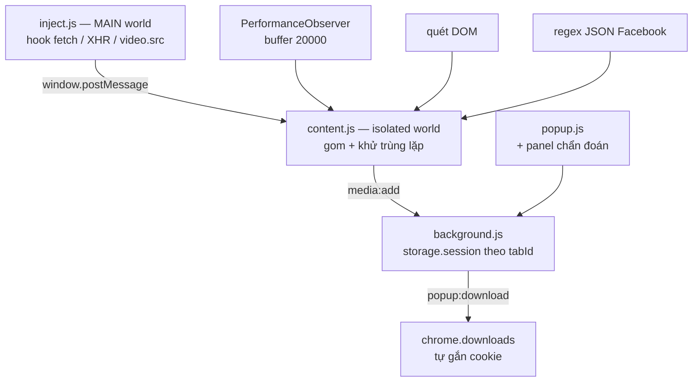

# Video Grabber

Extension Chrome/Edge/Cốc Cốc bắt mọi link video từ trang web đang mở — bao gồm video
trong **group private trên Facebook**.

Không cần cài Python, `yt-dlp` hay `ffmpeg`. Extension dùng chính session đăng nhập
sẵn có của bạn, nên nội dung trong group kín truy cập được mà không cần xác thực thêm.

## Cài đặt

1. Mở `chrome://extensions` (Edge: `edge://extensions`, Cốc Cốc: `coccoc://extensions`)
2. Bật **Developer mode** (góc trên phải)
3. Bấm **Load unpacked** → chọn thư mục `f:\project\fb-video-grabber`
4. Ghim extension lên thanh công cụ

## Cách dùng

### Trang web thông thường

1. Mở trang có video
2. **Bấm play** — extension chỉ thấy luồng dữ liệu khi video thực sự phát
3. Bấm icon extension → danh sách link hiện ra → **Tải**

### Facebook group private

1. Mở bài viết trong group
2. Bấm vào video để nó phát
3. Mở popup → bấm **Quét sâu**
4. Chọn link có nhãn `browser_native_hd_url` (chất lượng cao nhất) → **Tải**

> Link fbcdn có chữ ký và **hết hạn sau khoảng 1–2 giờ**. Nếu tải bị lỗi 403,
> bấm **Quét sâu** lại để lấy URL mới.

### YouTube

1. Mở video YouTube bất kỳ
2. Đợi 1–2 giây để extension quét `ytInitialPlayerResponse`
3. Mở popup — tab **⚡ Đang xem** (mặc định) hiển thị đúng video đang phát,
   gắn nhãn **🔥 ĐANG XEM**, xếp lên đầu danh sách
4. Sang tab **Tất cả** để xem toàn bộ link đã bắt:
   - **file** (xanh) = progressive stream, có cả video+audio, tải trực tiếp
   - **yt-adapt** (tím) = adaptive stream, chỉ hình hoặc chỉ tiếng
5. **Luôn ưu tiên link `file`** (thường có 360p và 720p)
6. Tải adaptive cần ghép bằng `ffmpeg` ngoài extension

> **Cách extension biết video nào đang phát:** YouTube phát qua MSE nên
> `video.src` luôn là `blob:` — không đọc được link thật từ thẻ `<video>`.
> `inject.js` lấy `videoId` từ URL (`/watch?v=`, `/shorts/`, `/live/`), đối chiếu
> với bảng `videoId → format progressive tốt nhất` dựng từ player response, rồi
> mới gắn cờ `isCurrent` cho đúng link đó. Vì vậy link "Đang xem" luôn là bản
> nét nhất và tải trực tiếp được.

> ⚠️ **Vì sao tải YouTube hay lỗi 403 (và trước đây ra file `.txt`):**
> URL trong `ytInitialPlayerResponse` có tham số `n` ở dạng **chưa giải mã** —
> chính player phải biến đổi `n` rồi mới gọi được. Gọi thẳng URL thô sẽ bị googlevideo
> trả `403` kèm `Content-Type: text/plain`, và Chrome lưu body rỗng đó thành `.txt`
> (đánh dấu "hoàn tất", nên rất dễ tưởng là đã tải xong).
> Vì vậy extension:
> 1. **Kiểm tra trước** bằng `Range: bytes=0-1` (message `content:probe`); nếu server
>    từ chối thì báo lỗi rõ ràng thay vì tạo file rác.
> 2. **Bắt link "live"** — URL `/videoplayback` mà chính player đã gọi, tức `n` đã
>    hợp lệ. Link này gắn nhãn `(live)` và tải được. Bỏ `range`/`rn` để lấy cả file;
>    luồng **SABR/UMP** (`sabr=1`) bị bỏ qua vì nội dung không phải file media thường.
>
> Muốn có link live: **bấm Play cho video chạy** vài giây rồi mở popup. Nếu video chỉ
> chạy qua SABR, extension sẽ không có link tải được — đây là giới hạn phía YouTube,
> không phải lỗi extension.

> Tốc độ tải YouTube có thể bị throttle (~50 KB/s). Đây là hạn chế phía server
> của YouTube (n-parameter throttling), không phải lỗi extension.

## Kiến trúc


```mermaid
flowchart TD
    A["inject.js — MAIN world<br/>hook fetch / XHR / video.src"] -->|"window.postMessage"| B
    P["PerformanceObserver<br/>buffer 20000"] --> B["content.js — isolated world<br/>gom + khử trùng lặp"]
    D["quét DOM"] --> B
    F["regex JSON Facebook"] --> B
    B -->|"media:add"| C["background.js<br/>storage.session theo tabId"]
    C -->|"popup:download"| E["chrome.downloads<br/>tự gắn cookie"]
    G["popup.js<br/>+ panel chẩn đoán"] --> C
```

### Bốn nguồn phát hiện video

| Nguồn | Bắt được gì |
|---|---|
| `inject.js` (MAIN world) | Hook `fetch`, `XMLHttpRequest.open`, `video.src` — bắt được luồng MSE/DASH mà 3 nguồn kia mù |
| `inject.js` YouTube parser | Trích xuất `ytInitialPlayerResponse` + hook fetch `/youtubei/v1/player` (SPA) |
| `PerformanceObserver` | Resource Timing, buffer đã nâng lên 20000 entry |
| Quét DOM | `<video src>`, `<video><source>`, `<a href="*.mp4">` |
| Regex JSON Facebook | `browser_native_hd_url`, `playable_url`, `hd_src`… nhúng trong `<script>` |

Nguồn cuối là lý do group private hoạt động: dữ liệu đó chỉ đọc được vì content
script chạy trong session đã đăng nhập của bạn.

### Hai cái bẫy đã xử lý

**1. Resource Timing buffer tràn.** Chrome mặc định chỉ giữ **250 entry**. Khi đầy,
entry mới bị **vứt bỏ hoàn toàn** và `PerformanceObserver` không hề hay biết.
Facebook nạp quá 250 tài nguyên trong vài giây → video phát sau đó mất trắng.
Đã nâng lên 20000 kèm handler `resourcetimingbufferfull`.

**2. `initiatorType` không phải `'video'`.** Facebook phát video qua MSE, player
gọi `fetch()` bằng JS của chính nó → `initiatorType` là `'fetch'`. Chỉ hook
`fetch`/XHR ở MAIN world mới bắt được.

### Vì sao cần `rules/referer.json`

`fbcdn.net` từ chối request không có `Referer: https://www.facebook.com/`.
Rule `declarativeNetRequest` chèn header đó vào các request media trỏ tới fbcdn.

## Phân loại link

| Nhãn | Ý nghĩa | Tải được? |
|---|---|---|
| `file` | File video hoàn chỉnh (`.mp4`) — kể cả progressive YouTube | ✅ Tải trực tiếp |
| `yt-adapt` | Adaptive YouTube (chỉ hình hoặc chỉ tiếng) | ⚠️ Cần ghép ffmpeg |
| `hls` / `dash` | Manifest `.m3u8` / `.mpd` | ❌ Cần ghép segment |
| `seg` | Một mảnh của luồng DASH | ❌ Vô dụng đơn lẻ |

**Luôn ưu tiên link `file`.** Link `seg` là từng mảnh của video bị cắt nhỏ —
tải một mảnh không cho bạn video hoàn chỉnh.

## Giới hạn đã biết

- **MV3 chỉ hỗ trợ Chrome/Edge/Cốc Cốc.** Firefox cần manifest khác
  (`background.scripts` thay vì `service_worker`).
- **Link `seg` không ghép được trong extension thuần.** Muốn ghép cần native host
  chạy `yt-dlp` + `ffmpeg`.
- Video **DRM** (Netflix, Disney+) không hỗ trợ và sẽ không được hỗ trợ.
- Facebook giới hạn tải nhanh liên tục — rải request ra, đừng tải hàng loạt.
- **YouTube progressive** thường chỉ có tối đa 720p (hạn chế của YouTube).
- **YouTube throttling:** tốc độ tải có thể bị giới hạn ~50 KB/s do n-parameter.
- Một số video YouTube có `signatureCipher` thay vì URL trực tiếp — extension không giải mã được.

## Cấu trúc

```
download-video-extension/
├── manifest.json          # MV3, service worker + content scripts
├── rules/
│   └── referer.json       # DNR: thêm Referer cho fbcdn.net, googlevideo, instagram
└── src/
    ├── social/
    │   ├── base.js        # Helper + interface chung cho mọi social module
    │   ├── fb/            # Facebook: inject, content, background, popup
    │   ├── ig/            # Instagram + Threads (dùng chung CDN/GraphQL của Meta)
    │   └── ytb/           # YouTube: inject, content, background, popup
    ├── media/
    │   └── engine.js      # Media Engine: phân loại file/hls/dash/segment, quyết định tải được hay không
    ├── inject.js          # MAIN world core: hook fetch / XHR / video.src, điều phối module
    ├── content.js         # isolated world core: gom nguồn, khử trùng lặp, gửi lên background
    ├── background.js      # Service worker: lưu trữ theo tab, gọi chrome.downloads
    ├── popup.html
    ├── popup.css
    └── popup.js
```

## Kiến trúc plugin (từ v0.4.0)

```
Browser
   ↓
Core hooks        inject.js / content.js  — fetch, XHR, video, DOM, PerformanceObserver
   ↓
Social plugins    src/social/<platform>/  — biết luật riêng của từng mạng xã hội
   ↓
Media candidate   { url, observedUrl, kind, sources, ytMeta, ... }
   ↓
Media engine      src/media/engine.js     — file / hls / dash / segment
   ↓
Download engine   background.js           — chrome.downloads + probe
```

Core không chứa tên miền hay luật riêng của Facebook/Instagram/YouTube. Mỗi module
đăng ký một interface chung và core chỉ gọi interface đó:

| World | Method |
|---|---|
| MAIN (`inject.js`) | `matchPage`, `matchUrl`, `matchApi`, `onRequest`, `onResponse`, `onVideoPlay`, `resolve`, `isCurrentRequest`, `init` |
| ISOLATED (`content.js`) | `matchPage`, `matchUrl`, `normalize`, `onCandidate`, `decorateCandidate`, `extractPostCode`, `scanScripts`, `scanRoot` |
| Background / Popup | `mediaKey`, `ignoreItem`, `updateItem`, `probeDownload`, `formatFilename`, `matchTab`, `filterItems`, `parseItemInfo` |

Mọi method đều tùy chọn — thiếu thì lấy default no-op từ `src/social/base.js`.

**Instagram & Threads dùng chung một module** (`src/social/ig/`): cùng CDN (`cdninstagram.com` /
`fbcdn.net`), cùng hạ tầng GraphQL, chỉ khác host và dạng URL bài viết (`/@user/post/CODE` so
với `/reel/CODE`). Thêm Threads không cần module mới.

**Thêm một platform mới (vd TikTok)** chỉ cần:

1. Tạo `src/social/tiktok/{inject,content,background,popup}.js`
2. Thêm 4 file đó vào `manifest.json`
3. Thêm 1 import + 1 dòng vào registry trong `background.js` và `popup.js`

Không phải sửa logic Facebook/Instagram/YouTube nào trong core.

> **Lưu ý hiệu năng:** core vẫn nằm trên `<all_urls>` (để bắt MP4/WebM ở mọi trang),
> nhưng module của platform chỉ được gọi khi `matchPage()` đúng. API response chỉ bị
> clone/đọc khi URL khớp endpoint của platform (`matchApi`) **và** content-type là
> JSON/text **và** dung lượng dưới 4MB.

## Công cụ Debug mạnh mẽ (Mới)

### 1. Nút Reload 1-Click ngay trong Popup
Không cần phải mở tab `chrome://extensions` để reload extension thủ công:
- Mở popup extension → mở rộng **🛠️ Chẩn đoán & Debug** → bấm **[🔄 Reload Ext & Tab]**.
- Extension sẽ tự nạp lại mã nguồn mới nhất và tự F5 tab web đang mở.

### 2. Live Logs & Đèn tín hiệu trong Popup
- **Đèn tín hiệu:** Kiểm tra tức thì trạng thái của Content Script và Inject Script (`✓ OK` hoặc `✗ Chưa chạy`).
- **Live Logs:** Xem trực tiếp 25 sự kiện gần nhất (link nào vừa được **[BẮT]**, link nào bị **[LOẠI]** kèm lý do cụ thể như: *DASH segment, host scontent ảnh, manifest...*).
- **[📋 Copy Log]:** 1-click copy toàn bộ thông số chẩn đoán và danh sách URL vào clipboard để báo lỗi hoặc kiểm tra.

### 3. Log Console có màu sắc riêng biệt (F12)
Mở Console (F12) trên trang web, logs được gán nhãn và màu sắc rõ ràng (không bị ẩn trong verbose):
- `[VG:Inject]` (Màu tím): Bắt đầu hook fetch, XHR, DOM gán src, bắt player response YouTube.
- `[VG:Content]` (Màu xanh lá): Gom luồng, lọc URL, phân loại format, gửi lên Background.
- `[VG:Background]` (Màu xanh dương): Lưu trữ session, điều khiển tải file download.

### 4. Lệnh nhanh trực tiếp trong Console (`window.__VG__`)
Trên bất kỳ trang web nào, mở F12 Console và gõ:
- `__VG__.status()`: Xem bảng tổng kết trạng thái (Observer, bộ đếm các nguồn, số link bị loại).
- `__VG__.items`: Lấy mảng toàn bộ video đã bắt được.
- `__VG__.logs`: Xem lịch sử log sự kiện chi tiết gần nhất.
- `__VG__.scan()`: Ép extension quét lại toàn bộ trang ngay lập tức.
- `__VG__.test("https://...", "source-tuỳ-chọn")`: Soi một URL qua đúng luồng chấm điểm của extension (chuẩn hoá → veto/nhận diện của từng platform → scontent → media host → media engine) và trả về object `{ ok, kind, engine, platform, stage, reason, decisions }`. Không thêm gì vào danh sách.
- `__VG__.idle`: `true` nghĩa là frame này chưa từng thấy media nên đang quét thưa (10s/lần thay vì 2.5s) — hữu ích khi debug các iframe không hiện trong danh sách.

---

## Bảng chẩn đoán lỗi thường gặp

| Chẩn đoán hiện | Nghĩa là | Cách khắc phục |
|---|---|---|
| `✗ CONTENT SCRIPT KHÔNG PHẢN HỒI` | Script chưa chạy được trong tab. Thường gặp ngay sau khi **reload extension**: tab đang mở vẫn giữ instance script cũ đã chết (`chrome.runtime` bị invalidated) | Popup **tự inject lại** script khi bạn mở nó (xem dòng `Đã thử inject lại script…`). Nếu vẫn lỗi thì bấm **[🔄 Reload Ext & Tab]** hoặc F5 |
| `⚠️ Thiếu src/social/base.js…` | `manifest.json` thiếu file hoặc sai thứ tự `js` | `base.js` phải nạp **trước** các module, `media/engine.js` nạp trước `content.js` |
| `⚠️ boot() lỗi: …` | Content script chạy được nhưng lúc khởi động bị lỗi | Xem lỗi đầy đủ trong Console (F12) của trang |
| `Observer: ✗ KHÔNG TẠO ĐƯỢC` | Trình duyệt không hỗ trợ Resource Timing | Nâng cấp trình duyệt Chromium |
| `inject.js: ✗ MAIN world chưa chạy` | MAIN world script bị chặn hoặc chưa nạp | Bấm Reload Ext & Tab |
| `Content script sống` + `0 URL` | Script hoạt động tốt nhưng chưa thấy dữ liệu | Bấm **Play** video để trình duyệt tải luồng |
| `bị loại` tăng cao | Các request là segment (.m4s, .ts) hoặc ảnh | Xem chi tiết trong mục Live Logs |
